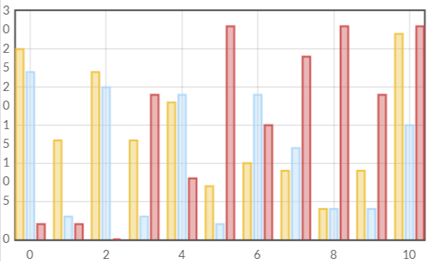
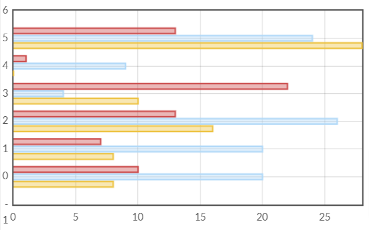

# flot-sidebyside-plugin

As you can see on this example, there are three bars for the same x value. Bars are side by side located. But for each bar the tooltip display the right x value.

## Vertical bars

## Horizontal bars

